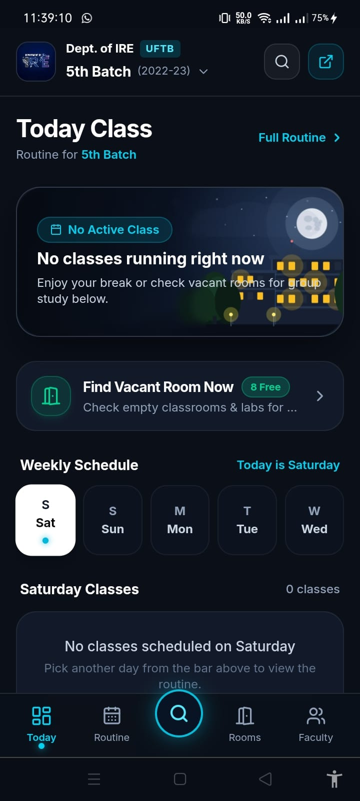
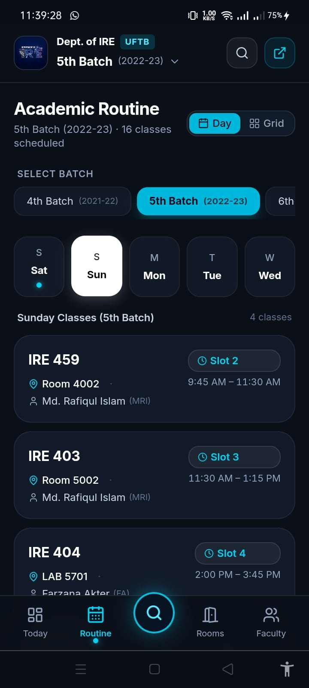
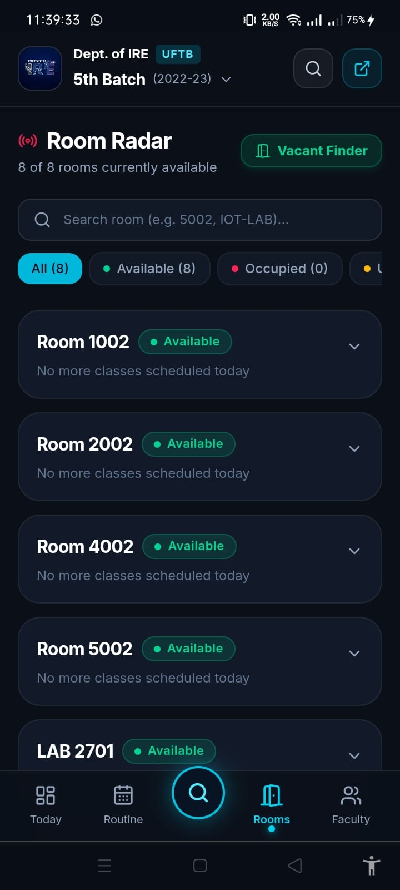
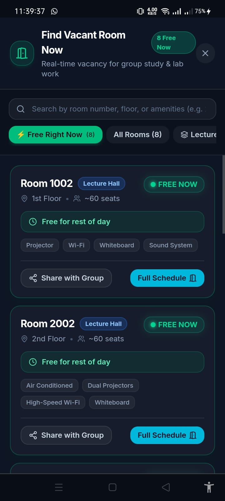
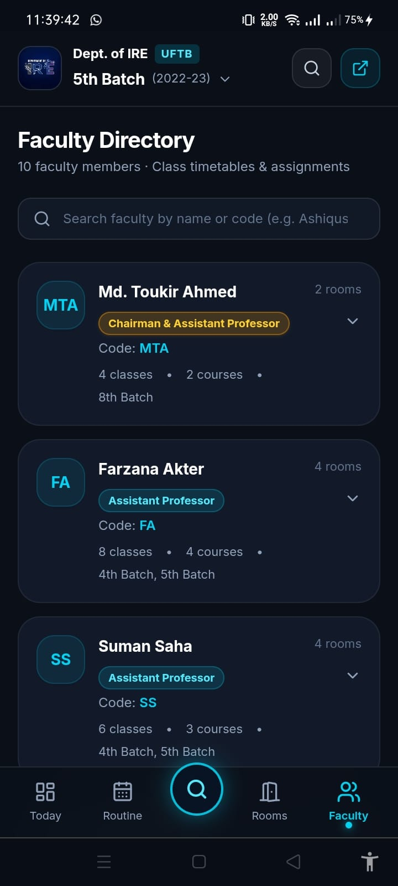

# Department Routine & Live Room Allocation System

> **Real-Time Timetable Engine, Dynamic Weather Campus Environment, and Vacant Room Allocator.**  
> Department of Internet of Things and Robotics Engineering (IRE)  
> University of Frontier Technology, Bangladesh (UFTB)  
>
> 🌐 **Live Web Application**: [https://ire-routine.netlify.app](https://ire-routine.netlify.app/)

[](https://ire-routine.netlify.app/)
[](https://react.dev/)
[](https://www.typescriptlang.org/)
[](https://vite.dev/)
[](https://tailwindcss.com/)
[](https://vitest.dev/)
[](https://web.dev/progressive-web-apps/)

An authentic, production-grade academic management web application built for the students, faculty members, and administrative officers of the Department of Internet of Things and Robotics Engineering (IRE). The system digitizes the official departmental timetable, tracks real-time classroom and lab vacancy across campus buildings, and provides an offline-first Progressive Web App (PWA) experience with live Dhaka atmospheric visualization.

---

## Application Showcase

| Dashboard & Atmosphere | Batch Routine Schedule | Real-Time Room Radar |
|:---:|:---:|:---:|
|  |  |  |

| Vacant Room Finder | Faculty Directory |
|:---:|:---:|
|  |  |

---

## Architecture Overview

```
                        +---------------------------+
                        |  Official Routine Source  |
                        |   (Routine 2026_New.pdf)  |
                        +-------------+-------------+
                                      |
                                      v
                        +---------------------------+
                        | Normalized Routine Data   |
                        | (5 Batches · 74 Classes)  |
                        +-------------+-------------+
                                      |
              +-----------------------+-----------------------+
              |                                               |
              v                                               v
+-----------------------------+               +-------------------------------+
|  Live Time & Clock Engine   |               |   Atmospheric Environment     |
|   (Asia/Dhaka BST Sync)     |               | (Open-Meteo API + Solar Track)|
+--------------+--------------+               +---------------+---------------+
               |                                              |
               v                                              v
+-----------------------------+               +-------------------------------+
| Room Allocation Service     |               | Dynamic Celestial Canvas      |
| - Occupied / Free / Upcoming|               | - Real-time Sun / Moon cycle  |
| - Time until free / next    |               | - Realistic Cumulus clouds    |
| - Vacant study room matcher |               | - Architectural silhouettes   |
+--------------+--------------+               +---------------+---------------+
               |                                              |
               +----------------------+-----------------------+
                                      |
                                      v
                        +---------------------------+
                        |   Mobile-First Web App    |
                        | (React 19 + PWA Offline)  |
                        +---------------------------+
```

---

## Features

### 1. Dynamic Weather & Celestial Hero Canvas
- **Time-Aware Atmosphere**: Calculates exact solar and lunar elevation angles using Bangladesh Standard Time (`Asia/Dhaka`).
- **Live Meteorological Feed**: Connects to the Open-Meteo API to reflect real-time local temperatures, rain conditions, and cloud coverage.
- **Architectural Silhouette**: Layered vector canvas rendering campus buildings with warm window illuminations at night, sunburst corona at noon, and golden twilight gradients at dusk.
- **Strict Readability Shield**: Frosted glass overlay ensures high contrast for class cards and routine details.

### 2. Live Room Allocation & Vacancy Finder
- **Real-Time State Machine**: Determines whether every lecture hall and laboratory is currently **Occupied**, **Available**, or **Upcoming** based on the current academic slot.
- **Vacant Room Finder**: Dedicated sheet modal for students to discover vacant rooms for impromptu group study, project collaboration, or hardware debugging.
- **Group Invite Generator**: One-tap "Share with Group" button copies formatted WhatsApp/Messenger invitation text with location, floor, and vacancy duration.
- **Countdown Timers**: Automatically computes remaining class duration and countdowns until the room becomes free.

### 3. Complete Batch Timetables
Full schedule coverage for all five departmental academic sessions:
- **4th Batch** (Session 2021–22)
- **5th Batch** (Session 2022–23)
- **6th Batch** (Session 2023–24)
- **7th Batch** (Session 2024–25)
- **8th Batch** (Session 2025–26)

Offers both a day-by-day card timeline and a desktop matrix grid view.

### 4. Faculty Schedules & Directory
- Complete weekly timetable, active teaching indicator, and course distribution for each faculty member.
- Structured directory covering Chairman, Assistant Professors, and Lecturers.

### 5. Progressive Web App (PWA) & Offline Reliability
- **Service Worker Cache**: Caches application assets, stylesheets, icons, and timetable data for instant offline access.
- **Installable Native App**: Install directly on Android, iOS home screen, or desktop without an app store.
- **Offline Indicator**: Automatic network monitoring alerts users when working in cached offline mode.

### 6. Instant Global Search
Search across course codes (e.g. `IRE 103`, `CSE 201`), rooms (`LAB 2701`, `5002`), faculty codes/names (`MAS`, `Ashiqussalehin`), and batches.

---

## Room & Laboratory Directory

| Room ID | Display Name | Category | Floor | Building | Capacity | Key Amenities |
|---|---|---|---|---|---|---|
| `1002` | Room 1002 | Lecture Hall | 1st Floor | Academic Building 1 | 60 | Projector, Wi-Fi, Sound System |
| `2002` | Room 2002 | Lecture Hall | 2nd Floor | Academic Building 1 | 60 | Air Conditioned, Dual Projectors, Wi-Fi |
| `4002` | Room 4002 | Lecture Hall | 4th Floor | Academic Building 1 | 60 | Air Conditioned, Interactive Screen |
| `5002` | Room 5002 | Lecture Hall | 5th Floor | Academic Building 1 | 60 | Air Conditioned, Projector, High-Speed Wi-Fi |
| `LAB-4701` | LAB 4701 | Specialized Lab | 4th Floor (Lab Wing) | Academic Building 1 | 45 | 45 Workstations, Air Conditioned, Gigabit LAN |
| `LAB-5701` | LAB 5701 | Specialized Lab | 5th Floor (Lab Wing) | Academic Building 1 | 45 | High-Spec Workstations, Linux, High-Speed LAN |
| `IOT-LAB` | LAB 2701 | Specialized Lab | 2nd Floor (Lab Wing) | Academic Building 1 | 35 | Hardware Workbenches, Soldering, Sensors & MCUs |
| `LAB-1202` | LAB 1202 | Specialized Lab | 1st Floor (Admin Wing) | Admin Building | 40 | Workstations, Air Conditioned, High-Speed LAN |

---

## Faculty Directory

| # | Faculty Member | Code | Official Designation | Weekly Classes |
|---|---|---|---|---|
| 1 | **Md. Toukir Ahmed** | `MTA` | Chairman & Assistant Professor | 8 Classes |
| 2 | **Farzana Akter** | `FA` | Assistant Professor | 8 Classes |
| 3 | **Suman Saha** | `SS` | Assistant Professor | 7 Classes |
| 4 | **Sadia Enam** | `SE` | Assistant Professor | 7 Classes |
| 5 | **Fahmida Ahmed Antara** | `FAA` | Assistant Professor | 8 Classes |
| 6 | **Md. Ashiqussalehin** | `MAS` | Lecturer | 8 Classes |
| 7 | **Md. Rafiqul Islam** | `MRI` | Lecturer | 7 Classes |
| 8 | **Mahir Mahbub** | `MM` | Lecturer | 8 Classes |
| 9 | **Saurav Chandra Das** | `SCD` | Lecturer | 8 Classes |
| 10 | **Mostafiz Ahammed** | `MAH` | Lecturer | 8 Classes |

---

## Technology Stack

| Layer | Technology | Purpose |
|---|---|---|
| **Framework** | [React 19](https://react.dev/) | Component architecture, hooks, and reactive UI |
| **Language** | [TypeScript 5.9](https://www.typescriptlang.org/) | Strict static typing, routine models, and contract safety |
| **Bundler** | [Vite 8](https://vite.dev/) | Instant HMR dev server and optimized production packaging |
| **Styling** | [TailwindCSS v4](https://tailwindcss.com/) | Mobile-first CSS utility framework and obsidian dark theme |
| **Icons** | [Lucide React](https://lucide.dev/) | Clean, consistent vector iconography |
| **Testing** | [Vitest](https://vitest.dev/) | 54 unit and data integrity tests with JSDOM environment |
| **PWA** | Service Worker + Web Manifest | Offline asset caching, fast boot, and home screen installation |
| **Weather Feed** | [Open-Meteo API](https://open-meteo.com/) | Real-time Dhaka temperature and meteorological telemetry |
| **Deployment** | [Netlify](https://www.netlify.com/) | Edge CDN hosting with SPA redirect configuration |

---

## Getting Started

### Prerequisites
- Node.js (v18.0.0 or higher)
- npm (v9.0.0 or higher) or pnpm

### Installation
```bash
# Clone the repository
git clone https://github.com/Masud744/department-routine.git
cd department-routine

# Install dependencies
npm install
```

### Running Locally
```bash
npm run dev
```
Open [http://localhost:5173](http://localhost:5173) in your web browser.

### Running Test Suite
```bash
npm test
# or run with coverage
npx vitest run
```

### Production Build & Deployment
```bash
npm run build
```
The project includes `netlify.toml` and `public/_redirects` configured out of the box for one-click deployment on [Netlify](https://ire-routine.netlify.app/).

---

## Developed By

**Shahriar Alom Masud**  
B.Sc. Engg. in IoT & Robotics Engineering  
University of Frontier Technology, Bangladesh  

- **Email**: [shahriar0002@std.uftb.ac.bd](mailto:shahriar0002@std.uftb.ac.bd)
- **Personal Email**: [masud.nil74@gmail.com](mailto:masud.nil74@gmail.com)
- **LinkedIn**: [https://www.linkedin.com/in/shahriar-alom-masud](https://www.linkedin.com/in/shahriar-alom-masud)
- **GitHub**: [https://github.com/Masud744](https://github.com/Masud744)

---

## Official Links
- **Live Application**: [https://ire-routine.netlify.app/](https://ire-routine.netlify.app/)
- **Department Website**: [https://ire.uftb.ac.bd/](https://ire.uftb.ac.bd/)
- **University**: [University of Frontier Technology, Bangladesh (UFTB)](https://uftb.ac.bd/)

---

## License

This project is licensed under the MIT License — see the [LICENSE](LICENSE) file for details.
